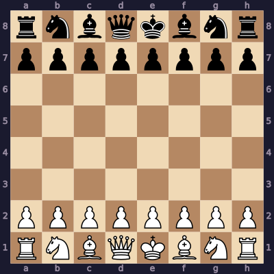

 

&nbsp;

---

- 🔭 Currently building **AI Automated Blog Site**
- 🚀 Just open-sourced **[AutoJob](https://github.com/arham-sayyed/autojob)**  an AI-powered job-search automation pipeline
- 🌱 Learning **React Native**
- 👨‍💻 Selected projects on [github.com/arham-sayyed](https://github.com/arham-sayyed) — the good stuff ships elsewhere
- 💬 Ask me about **MERN Stack, TypeScript, APIs & Cyber Security**
- 📫 **arhamsayyed.dev@gmail.com**
- 📄 Resume: [View PDF](https://github.com/arham-sayyed/resume/blob/main/Arham_Sayyed_Resume_censored.pdf)
- 👓 [linkedin.com/in/arham-sayyed](https://www.linkedin.com/in/arham-sayyed/)
- ⚡ I debug best at 2am with some music and caffeine

 

> *"ship first, optimise later — unless it's prod, then cry first"*

---

<h3 align="left">Connect with me:</h3>

  
  
  
  
  
  

---

<h3 align="left">Languages and Tools:</h3>

  
  
  
  
  
  
  
  
  
  
  
  
  
  
  
  
  
  
  
  
  

---

## ♟️ Play Chess With Me

Anyone can make a move. Click a link below — it opens a pre-filled GitHub Issue. Just hit **Submit** and the bot plays it in seconds.

📜 [View the leaderboard](leaderboard.md) — every game ever played, with the White/Black rosters and final result.

<!-- CHESS_START -->

**Black ♟ to move** — click any move to play it:

[a5](https://github.com/arham-sayyed/arham-sayyed/issues/new?title=chess%3A%20a7a5&body=Playing+a7a5+%28a5%29) · [a6](https://github.com/arham-sayyed/arham-sayyed/issues/new?title=chess%3A%20a7a6&body=Playing+a7a6+%28a6%29) · [b5](https://github.com/arham-sayyed/arham-sayyed/issues/new?title=chess%3A%20b7b5&body=Playing+b7b5+%28b5%29) · [b6](https://github.com/arham-sayyed/arham-sayyed/issues/new?title=chess%3A%20b7b6&body=Playing+b7b6+%28b6%29) · [c5](https://github.com/arham-sayyed/arham-sayyed/issues/new?title=chess%3A%20c7c5&body=Playing+c7c5+%28c5%29) · [c6](https://github.com/arham-sayyed/arham-sayyed/issues/new?title=chess%3A%20c7c6&body=Playing+c7c6+%28c6%29) · [d5](https://github.com/arham-sayyed/arham-sayyed/issues/new?title=chess%3A%20d7d5&body=Playing+d7d5+%28d5%29) · [d6](https://github.com/arham-sayyed/arham-sayyed/issues/new?title=chess%3A%20d7d6&body=Playing+d7d6+%28d6%29) · [e5](https://github.com/arham-sayyed/arham-sayyed/issues/new?title=chess%3A%20e7e5&body=Playing+e7e5+%28e5%29) · [e6](https://github.com/arham-sayyed/arham-sayyed/issues/new?title=chess%3A%20e7e6&body=Playing+e7e6+%28e6%29) · [f5](https://github.com/arham-sayyed/arham-sayyed/issues/new?title=chess%3A%20f7f5&body=Playing+f7f5+%28f5%29) · [f6](https://github.com/arham-sayyed/arham-sayyed/issues/new?title=chess%3A%20f7f6&body=Playing+f7f6+%28f6%29) · [g5](https://github.com/arham-sayyed/arham-sayyed/issues/new?title=chess%3A%20g7g5&body=Playing+g7g5+%28g5%29) · [g6](https://github.com/arham-sayyed/arham-sayyed/issues/new?title=chess%3A%20g7g6&body=Playing+g7g6+%28g6%29) · [h5](https://github.com/arham-sayyed/arham-sayyed/issues/new?title=chess%3A%20h7h5&body=Playing+h7h5+%28h5%29) · [h6](https://github.com/arham-sayyed/arham-sayyed/issues/new?title=chess%3A%20h7h6&body=Playing+h7h6+%28h6%29)

[Na6](https://github.com/arham-sayyed/arham-sayyed/issues/new?title=chess%3A%20b8a6&body=Playing+b8a6+%28Na6%29) · [Nc6](https://github.com/arham-sayyed/arham-sayyed/issues/new?title=chess%3A%20b8c6&body=Playing+b8c6+%28Nc6%29) · [Nf6](https://github.com/arham-sayyed/arham-sayyed/issues/new?title=chess%3A%20g8f6&body=Playing+g8f6+%28Nf6%29) · [Nh6](https://github.com/arham-sayyed/arham-sayyed/issues/new?title=chess%3A%20g8h6&body=Playing+g8h6+%28Nh6%29)

---
[🔄 Reset board](https://github.com/arham-sayyed/arham-sayyed/issues/new?title=chess%3A%20reset&body=Resetting+the+board)

<!-- CHESS_END -->

---

<!-- 

--- -->

  
  

  

---

  

---

---

<picture>
  <source media="(prefers-color-scheme: dark)" srcset="https://raw.githubusercontent.com/arham-sayyed/arham-sayyed/output/github-contribution-grid-snake-dark.svg" />
  <source media="(prefers-color-scheme: light)" srcset="https://raw.githubusercontent.com/arham-sayyed/arham-sayyed/output/github-contribution-grid-snake.svg" />
  
</picture>

---

<h3 align="left">Support:</h3>

